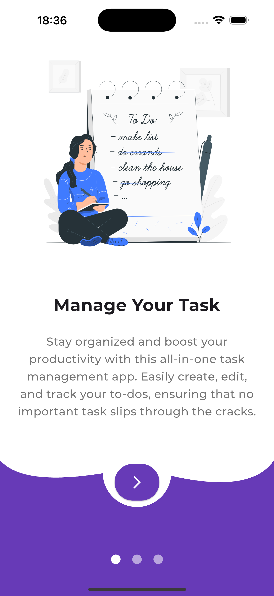
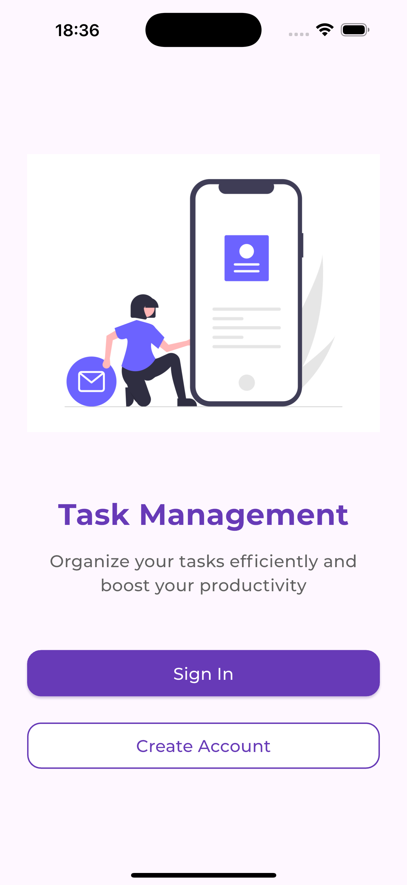
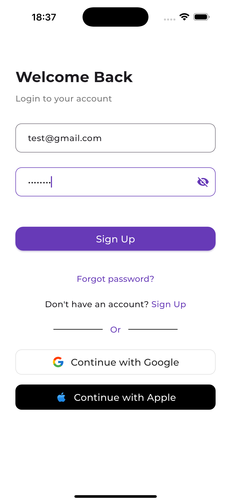
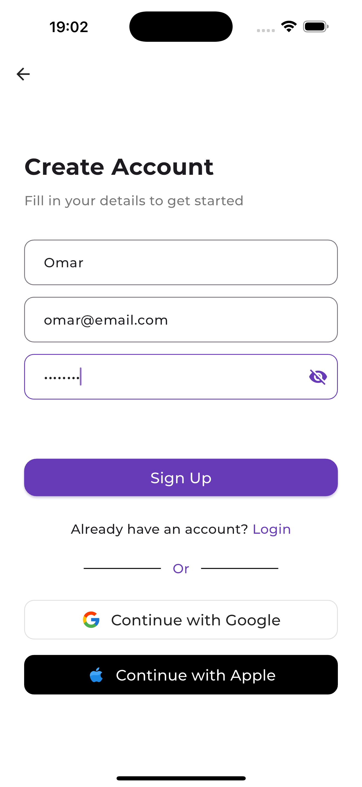
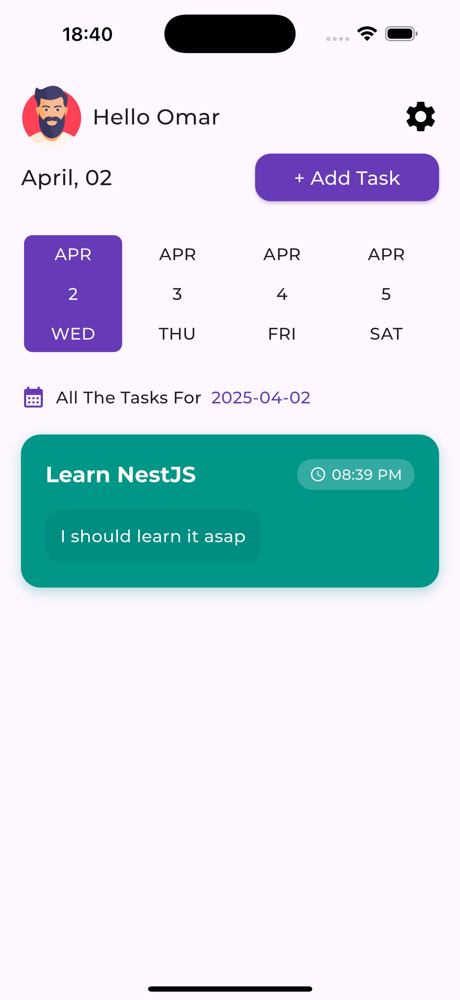
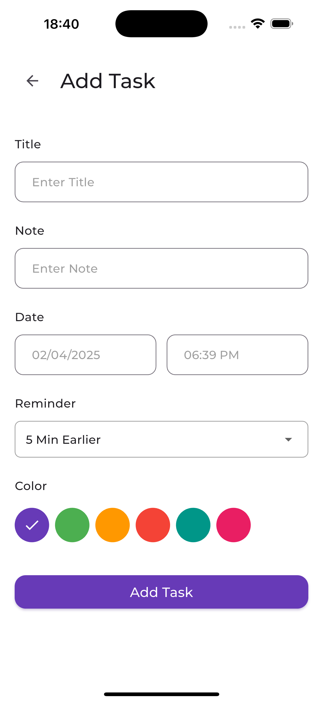
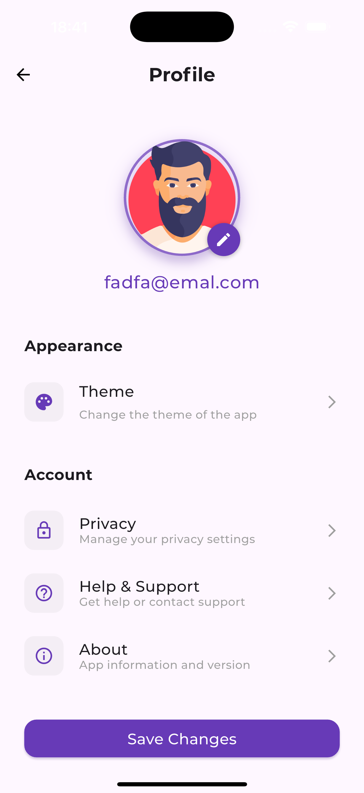
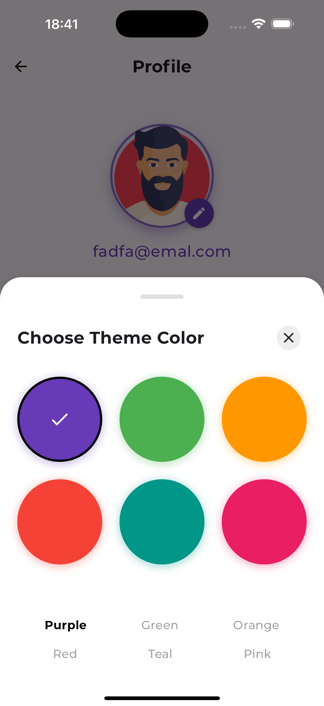

# ✨ My Todo App

A modern, minimalist task management application built with Flutter. Stay organized and boost your productivity with our intuitive interface. Built using Clean Architecture principles for maintainable, testable, and scalable code.

## Star ⭐ the repo if you like what you see 😉.

## 🌟 Features

- ✨ Clean, modern UI design
- 🔐 Authentication with Custom Backend
- 📱 Cross-platform support (iOS & Android)
- 🎨 Customizable themes
- 🔔 Reminders and notifications
- 🏗️ Clean Architecture implementation
- 🧩 Feature-first organization
- 🔄 Dependency Injection
- ⚡ Efficient state management with Cubit

## 📸 Screenshots

|  |  |  |
|---|---|---|
|  |  |  |
|  |  |  |


## 🏗️ Architecture

This application follows **Clean Architecture** principles with a feature-first approach:

```
lib/
├── core/                  # Shared core components
│   ├── constants/         # App-wide constants
│   ├── di/                # Dependency injection
│   ├── errors/            # Error handling
│   ├── models/            # Core models
│   ├── network/           # Network utilities
│   ├── route/             # Navigation/routing
│   ├── services/          # Core services
│   ├── theme/             # App theming
│   ├── utils/             # Helper utilities
│   ├── value_objects/     # Domain value objects
│   └── widgets/           # Reusable widgets
│
├── features/              # App features
│   ├── auth/              # Authentication feature
│   ├── onboarding/        # Onboarding feature
│   ├── profile/           # User profile feature
│   ├── splash/            # Splash screen feature
│   ├── task/              # Task management feature
│   │   ├── data/          # Task data layer (repositories, data sources)
│   │   ├── blocs/         # Task state management
│   │   └── presentation/  # Task UI components
│   └── welcome/           # Welcome feature
│
└── main.dart              # App entry point
```

Each feature follows the same layered architecture:

- **Data Layer**: API clients, repositories, local storage
- **Presentation Layer**: UI components, screens, widgets
- **State Management**: Cubits/BLoCs as a glue between the two layer for managing state

## 🛠️ Tech Stack

- Flutter
- Cubit (State Management)
- GoRouter (Navigation)

## 🚀 Getting Started

### Backend Setup

For detailed backend setup instructions, visit [my-todo-api](https://github.com/OmarJ9/todo-api-nestjs#readme)

### Flutter App Setup

1. Clone the repository

```bash
git clone https://github.com/OmarJ9/my-todo.git
cd my-todo
```

2. Install dependencies

```bash
flutter pub get
```

3. Run the app

```bash
flutter run
```

## 🤝 Contributing

Contributions are welcome! Please feel free to submit a Pull Request.

Made with ❤️ by Omar
