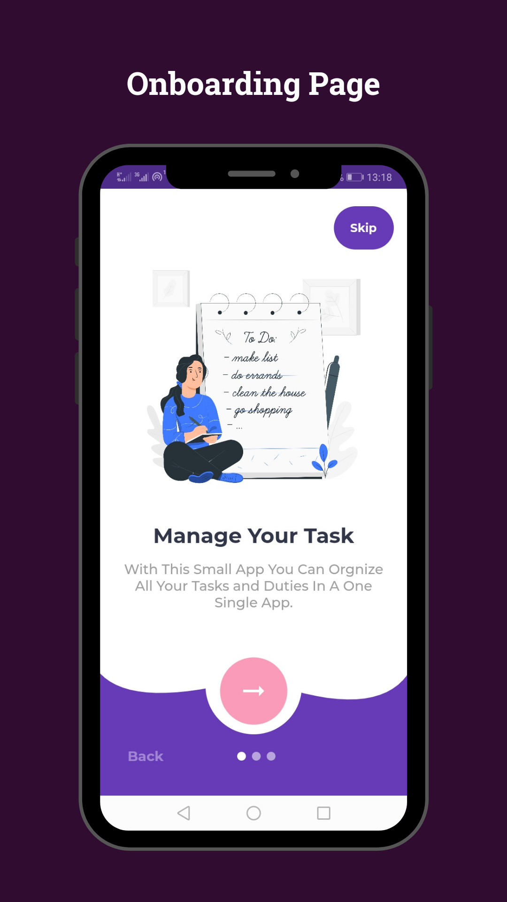
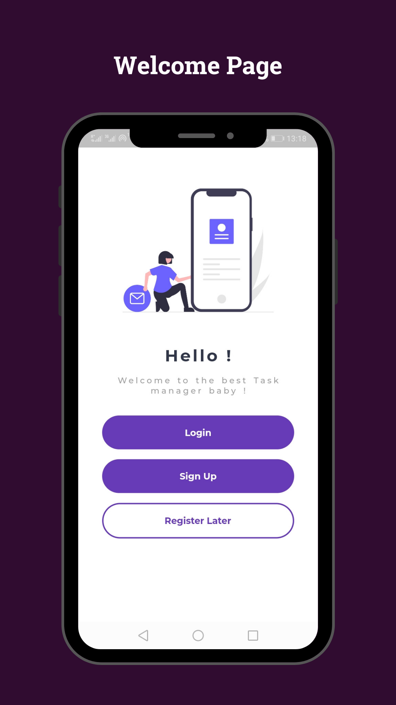
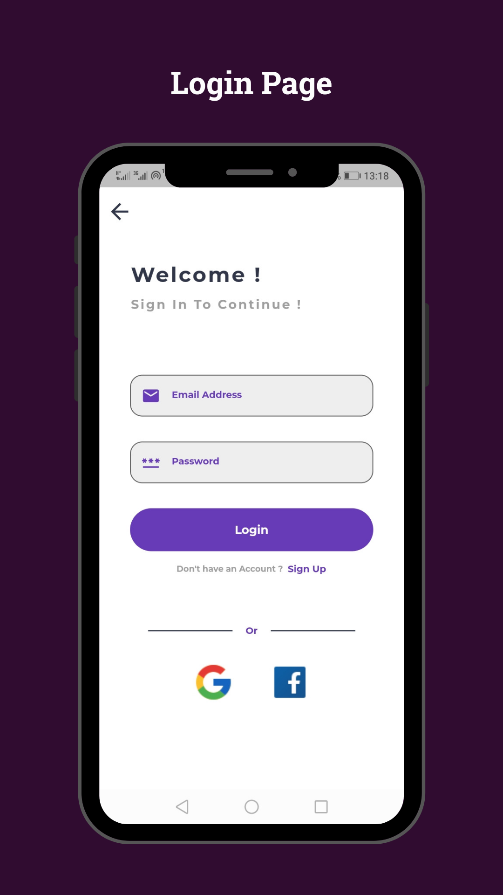
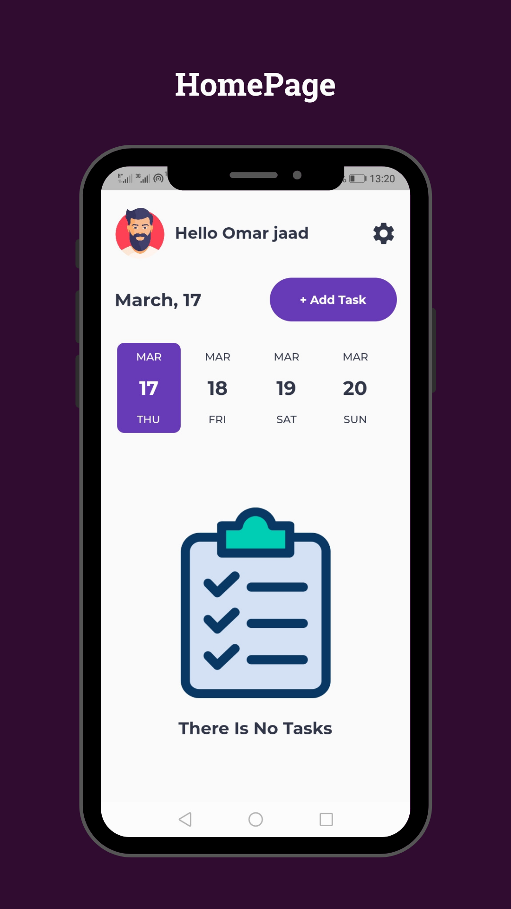
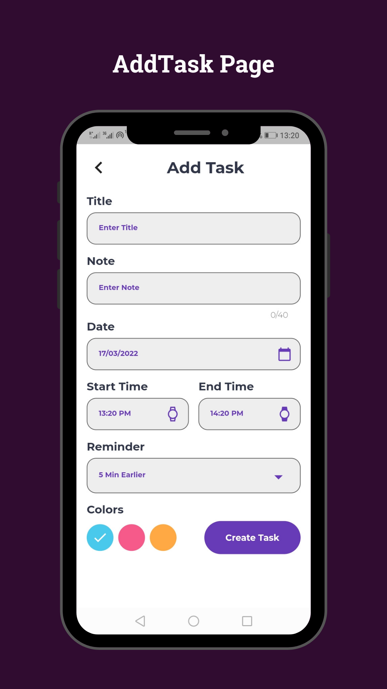
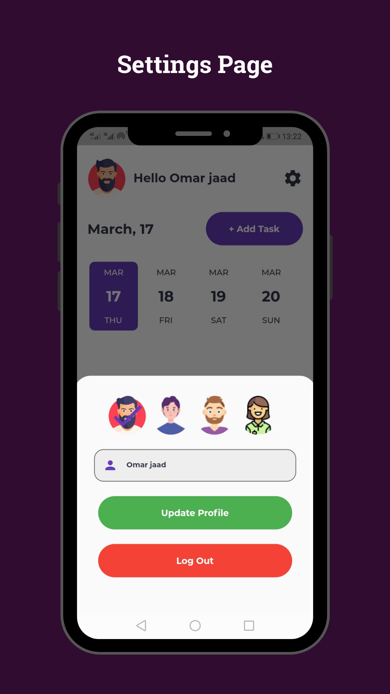

# 🔥 Todo App

An App To manage all your tasks with firebase backend.

Star⭐ the repo if you like what you see😉.

## ✨ Features :
- Login/SignUp with Firebase.
- Login/SignUp with Google Account.
- You don't have to login (Anonymous Mode).
- Add/Remove Tasks Offline.
- Beautiful UI.
- Beautiful Animation.
- The App will notify you when a task begins/ends.

## 📸 Screenshots :

  
  

**=> The icons are from [FlatIcon](https://www.flaticon.com/)**

**=> The images are from [Storyset](https://storyset.com/)**

## If you want to use this project add your firebase's account.

